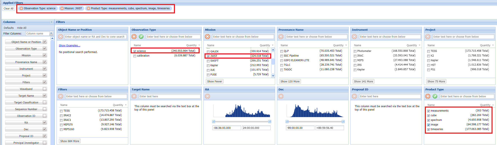

# Stellar Anomaly Detector
This repository provides an anomaly detection model trained on data from the James Webb Space Telescope (JWST). The model uses an Isolation Forest algorithm to identify anomalies in various JWST data types, including timeseries, images, spectra, catalogs, cubes, and measurements. Key parameters were finely tuned using a Randomized Search for Hyperparameter Optimization, and the model incorporates advanced Feature Engineering, Data Normalization, and detailed Performance Metrics to ensure high accuracy and reliability.

# Data Acquisition
To obtain the data sets needed for running the model, follow these steps:
1.	Visit the [MAST Portal](https://mast.stsci.edu/portal/Mashup/Clients/Mast/Portal.html).
2.	Go to the "Advanced Search" section.
3.	Under "Mission," select JWST.
4.	Choose the desired "Product Type" (e.g., timeseries, image, spectrum, catalog, cube, measurements) to download the data set. You can select one or more product types based on your analysis needs.
5.	Under "Observation Type," select science to filter for relevant data.

The datasets used to develop this model were also sourced from this platform.



# Model Performance
The model's performance varies depending on the data type used. Below are the results obtained on a dataset with 5,000 entries for each data type.

**1.	All Product Types (timeseries, image, spectrum, catalog, cube, measurements):**
*  **Accuracy:** 87.69%
* **False Positive Rate:** 6.66%

```plaintext
# AI Model Output
{'Total Anomalies Added': 999, 'Correctly Detected Anomalies': 876, 'False Positives': 229, 'Accuracy': 0.8768768768768769, 'False Positive Rate': 0.06664726426076834, 'Best Params IF': {'contamination': 0.24958833021525914, 'max_features': 0.7, 'max_samples': 0.6, 'n_estimators': 500}}
```

**2. Images Only:**
*  **Accuracy:** 92.39%
* **False Positive Rate:** 7.74%

```plaintext
# AI Model Output
{'Total Anomalies Added': 999, 'Correctly Detected Anomalies': 923, 'False Positives': 303, 'Accuracy': 0.923923923923924, 'False Positive Rate': 0.07743419371326347, 'Best Params IF': {'contamination': 0.24958833021525914, 'max_features': 0.7, 'max_samples': 0.6, 'n_estimators': 500}}
```
# How to Use the Anomaly Detection Script

This script allows you to detect anomalies in JWST data using the pre-trained model provided in this repository. Follow the steps below to use the script effectively:

**1.	Download the Necessary Files:**
* Ensure you have the sad_model.pkl file in your working directory. This file contains the pre-trained anomaly detection model.
* Download the sample data file MAST_allmix_100_with_anomaly_JWST.csv from this repository, or use your own JWST dataset. The dataset should contain the following columns: s_ra, s_dec, t_min, t_max, t_exptime, em_min, em_max.
  
**2.	Prepare Your Environment:**
* Ensure you have Python installed on your system. You will need Python 3.7 or later. The project was developed in Python 3.11 environment.
* Install the necessary Python libraries by running:

```bash
pip install pandas scikit-learn numpy
```

Run the script using the following command:

```bash
python sad.py
```

**3. Understanding the Output**
* The script will print the rows in your dataset identified as anomalies based on the model.
* Use this feedback to analyze unusual data points that could indicate significant deviations in your dataset.

**Note:** The sample dataset MAST_allmix_100_with_anomaly_JWST.csv is designed to help you test the model. It contains injected anomalies to simulate realistic detection scenarios.

Feel free to adjust the script according to your needs, such as changing the dataset path or modifying the feature engineering steps based on your specific data characteristics.

